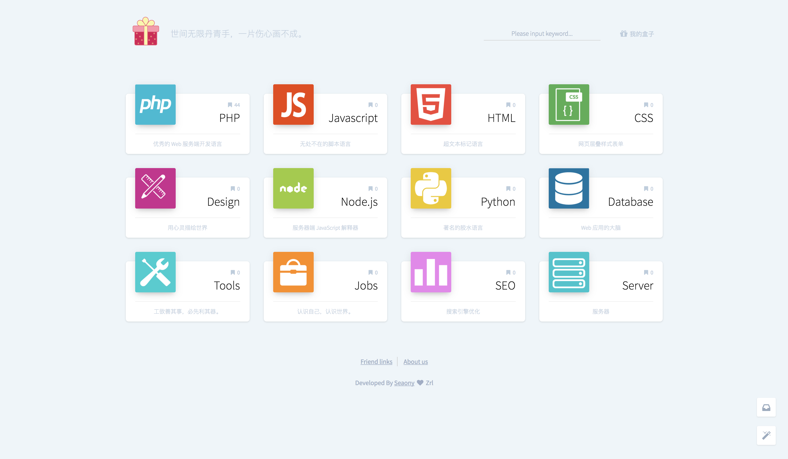

糖果盒子 - WEB 开发者的书签导航

 

 
--

 

## 项目概述

* 项目名称：[糖果盒子 - WEB 开发者的书签导航](http://hunt.seaony.cn/)
* 作者：[Seaony](https://github.com/Seaony)

糖果盒子是采用 Laravel 5.5 + Pjax 开发的站点导航应用，专注分享优质 Web 开发资源站点，希望成为 Web 开发人员最喜爱的的书签导航。

## 线上地址

[糖果盒子 - WEB 开发者的书签导航](http://hunt.seaony.cn/)
